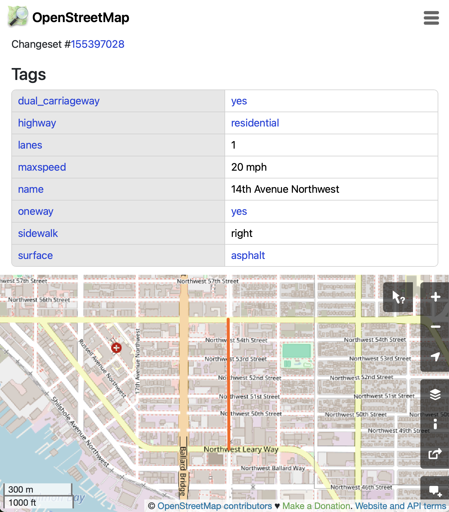
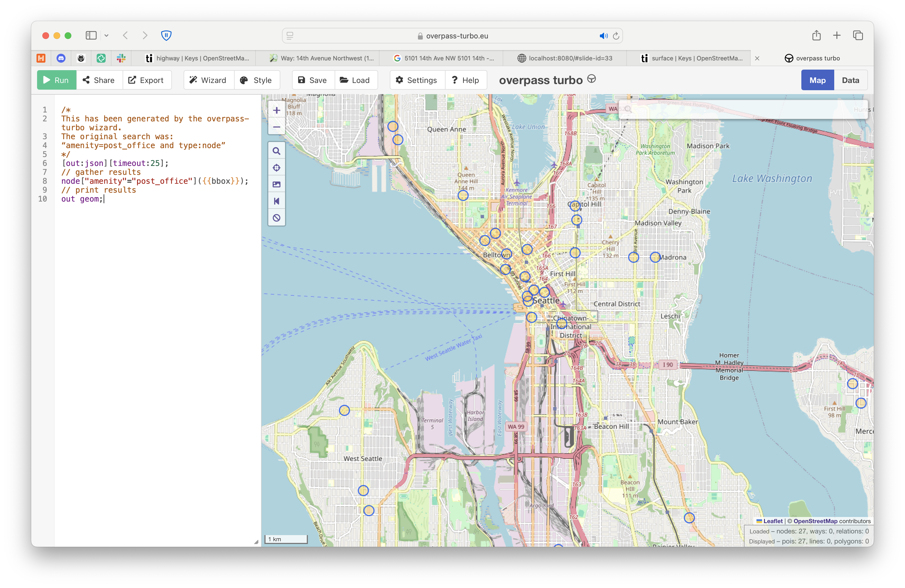

# Hi


# <br /><br />Using OpenStreetMap Data

Now that we've all spent some time putting data **into** OSM,
let's get some data **out** of OSM.

# But first...
## &nbsp;&nbsp;&nbsp;&nbsp;&nbsp; a pedantic diversion.

# What is OpenStreetMap?

- ???

# What is OpenStreetMap?

- It's a website: [openstreetmap.org](https://openstreetmap.org).

# What is OpenStreetMap?

- It's a website: [openstreetmap.org](https://openstreetmap.org).
- ???

# What is OpenStreetMap?

- It's a website: [openstreetmap.org](https://openstreetmap.org).
- It's an accumulation of facts (a database).

# Facts, you say?

# Facts, you say?

Two kinds of facts in OSM.

# Facts, you say?

<div class="column">

## Geometry

Where the thing is.

</div>

# Facts, you say?

<div class="column">

## Geometry

Where the thing is.

</div>

<div class="column">

## Tags

What the thing is.

</div>

# Facts, you say?

<div class="column">

## Geometry
<p>
<span class="highlight-bg">
Where the thing is.
</span>
</p>

</div>

<div class="column">

## Tags

What the thing is.

</div>

# Geometry: Where the thing is

All geometry in OSM is stored as latitude and longitude (e.g. no projected points).

# It's a big planet out there.

<div class="column">

To avoid examining the entire planet, typically you'll "bound" your area of interest.

**Seattle's approximate bounds**<br />
bottom left: -122.46, 47.48 <br />
top right: -122.22, 47.73

</div>
<div class="column">

</div>


# Facts, you say?

<div class="column">

## Geometry ✅

Where the thing is.

</div>

<div class="column">

##  <span style="line-height: 92px">Tags</span>

What the thing is.

</div>


# Facts, you say?

<div class="column">

## Geometry ✅

Where the thing is.

</div>

<div class="column">

##  <span style="line-height: 92px">Tags</span>

<span class="highlight-bg">What the thing is.</span>

</div>

# Tags: What the thing is


# Tags: What the thing is

<table style="text-align:center;">
<tr>
  <th width="50%">Thing</th>
  <th></th>
</tr>
<tr>
<td>a highway</td>
<td class="osm-tag"></td>
</tr>
<tr>
<td></td>
<td class="osm-tag"></td>
</tr>
<tr>
<td></td>
<td class="osm-tag"></td>
</tr>
<tr>
<td></td>
<td class="osm-tag"></td>
</tr>
</table>

# Tags: What the thing is

<table style="text-align:center;">
<tr>
  <th width="50%">Thing</th>
  <th></th>
</tr>
<tr>
<td>a highway</td>
<td class="osm-tag"></td>
</tr>
<tr>
<td>a park</td>
<td class="osm-tag"></td>
</tr>
<tr>
<td></td>
<td class="osm-tag"></td>
</tr>
<tr>
<td></td>
<td class="osm-tag"></td>
</tr>
</table>

# Tags: What the thing is

<table style="text-align:center;">
<tr>
  <th width="50%">Thing</th>
  <th></th>
</tr>
<tr>
<td>a highway</td>
<td class="osm-tag"></td>
</tr>
<tr>
<td>a park</td>
<td class="osm-tag"></td>
</tr>
<tr>
<td>a building</td>
<td class="osm-tag"></td>
</tr>
<tr>
<td>a water fountain</td>
<td class="osm-tag"></td>
</tr>
</table>

# Tags: What the thing is

<table style="text-align:center;">
<tr>
  <th width="50%">Thing</th>
  <th>Tag</th>
</tr>
<tr>
<td>a highway</td>
<td class="osm-tag"></td>
</tr>
<tr>
<td>a park</td>
<td class="osm-tag"></td>
</tr>
<tr>
<td>a building</td>
<td class="osm-tag"></td>
</tr>
<tr>
<td>a water fountain</td>
<td class="osm-tag"></td>
</tr>
</table>

# Tags: What the thing is

<table style="text-align:center;">
<tr>
  <th width="50%">Thing</th>
  <th>Tag</th>
</tr>
<tr>
<td>a highway</td>
<td class="osm-tag">highway=motorway</td>
</tr>
<tr>
<td>a park</td>
<td class="osm-tag"></td>
</tr>
<tr>
<td>a building</td>
<td class="osm-tag"></td>
</tr>
<tr>
<td>a water fountain</td>
<td class="osm-tag"></td>
</tr>
</table>

# Tags: What the thing is

<table style="text-align:center;">
<tr>
  <th width="50%">Thing</th>
  <th>Tag</th>
</tr>
<tr>
<td>a highway</td>
<td class="osm-tag">highway=motorway</td>
</tr>
<tr>
<td>a park</td>
<td class="osm-tag">leisure=park</td>
</tr>
<tr>
<td>a building</td>
<td class="osm-tag"></td>
</tr>
<tr>
<td>a water fountain</td>
<td class="osm-tag"></td>
</tr>
</table>

# Tags: What the thing is

<style>
table .osm-tag {
    font-family: monospace;
}
</style>
<table style="text-align:center;">
<tr>
  <th width="50%">Thing</th>
  <th>Tag</th>
</tr>
<tr>
<td>a highway</td>
<td class="osm-tag">highway=motorway</td>
</tr>
<tr>
<td>a park</td>
<td class="osm-tag">leisure=park</td>
</tr>
<tr>
<td>a building</td>
<td class="osm-tag">building=house</td>
</tr>
<tr>
<td>a water fountain</td>
<td class="osm-tag">amenity=drinking_water</td>
</tr>
</table>

# Tags: What the thing is

<style>
.osm-tag {
    font-family: monospace;
}
</style>
<table style="text-align:center;">
<tr>
  <th width="50%">Thing</th>
  <th>Tag</th>
</tr>
<tr>
<td>a highway</td>
<td class="osm-tag highlight-bg">highway=motorway</td>
</tr>
<tr>
<td>a park</td>
<td class="osm-tag">leisure=park</td>
</tr>
<tr>
<td>a building</td>
<td class="osm-tag">building=house</td>
</tr>
<tr>
<td>a water fountain</td>
<td class="osm-tag">amenity=drinking_water</td>
</tr>
</table>


<p style="text-align: center; font-weight: bold">Let's take a closer look.</p>

# Tags: A closer look. 👀

<p style="margin-top: -40px;" class="osm-tag">highway=motorway</p>

Tags are "key value" pairs.

- **key:** `highway`
- **value**: `motorway`

# Tags: A closer look. 👀

<div class="column">

**key:** `highway`

A given `key` has potentialy many values

</div>
<div class="column">

- `highway=motorway`
- `highway=residential`
- `highway=trunk`
- `highway=service`
- and more!

</div>

# Tags: What do they all mean?

<div style="margin-top: -32px">

- `highway=motorway`
- `highway=residential`
- `highway=trunk`
- `highway=service`

</div>

taginfo: An OSM mapper's best friend.
<https://taginfo.openstreetmap.org/keys/highway#values>

# An example, right outside.

[www.openstreetmap.org/way/140804207](https://www.openstreetmap.org/way/140804207#map=16/47.66617/-122.37364)

<br />
<br />
<br />
<br />



# Tag as many as you'd like!

<https://taginfo.openstreetmap.org/keys/highway#combinations>

# Facts, you say?

<div class="column">

## Geometry ✅

Where the thing is.

</div>

<div class="column">

##  <span style="line-height: 92px">Tags</span>

What the thing is.

</div>


# Facts, you say?

<div class="column">

## Geometry ✅

Where the thing is.

</div>

<div class="column">

##  <span style="line-height: 92px">Tags ✅</span>

What the thing is.

</div>

# But first...
## <span style="line-height: 92px">&nbsp;&nbsp;&nbsp;&nbsp;&nbsp; a pedantic diversion.</span>

# But first...
## <span style="line-height: 92px">&nbsp;&nbsp;&nbsp;&nbsp;&nbsp; a pedantic diversion. ✅✅✅</span>

# But first...
## <span style="line-height: 92px">&nbsp;&nbsp;&nbsp;&nbsp;&nbsp; a pedantic diversion. ✅✅✅</span>

# 
<h2 style="text-align: center; margin-top: -32px;">(starting over)</h2>
<h1>Using OpenStreetMap Data</h1>

Now that we've all spent some time putting data **into** OSM,
let's get some data **out** of OSM.

# Overpass t-t-t-turbo 🔥🔥🔥

Overpass Turbo is a website for getting specific data out of OSM.

<https://overpass-turbo.eu>



# Overpass t-t-t-turbo 🔥🔥

- Run your query

# Overpass t-t-t-turbo 🔥🔥

- Run your query
- Export your preferred format

# Overpass: ⚠️ caveats

# Overpass: ⚠️ caveats

The query language is

# Overpass: ⚠️ caveats

The query language is...

# Overpass: ⚠️ caveats

The query language is... really something.

# Overpass: ⚠️ caveats

The query language is... really something.

It's powerful, but not easy for me.

# Overpass: ⚠️ caveats

The query language is... really something.

It's powerful, but not easy for me.

Try chatgpt? (But verify!!)

# Overpass: ⚠️ caveats

> It can take a couple of minutes for [changes](https://wiki.openstreetmap.org/wiki/Changeset "Changeset") to the [database](https://wiki.openstreetmap.org/wiki/Database "Database") to show up in the Overpass API query results.

from: <https://wiki.openstreetmap.org/wiki/Overpass_API>

# An aside

You know about [wiki.openstreetmap.org](https://wiki.openstreetmap.org), right?

# What is OpenStreetMap?

- It's a website: [openstreetmap.org](https://openstreetmap.org).
- It's an accumulation of facts (a database).

# What is OpenStreetMap?

- It's a website: [openstreetmap.org](https://openstreetmap.org).
- It's an accumulation of facts (a database).
- ???

# What is OpenStreetMap?

- It's a website: [openstreetmap.org](https://openstreetmap.org).
- It's an accumulation of facts (a database).
- It's a bunch of supporting documentation and documented techniques.

# What is OpenStreetMap?

- It's a website: [openstreetmap.org](https://openstreetmap.org).
- It's an accumulation of facts (a database).
- It's a bunch of supporting documentation and documented techniques.
  - [wiki.openstreetmap.org](https://wiki.openstreetmap.org)
  - [overpass-turbo.eu](https://overpass-turbo.eu)
  - [taginfo.openstreetmap.org](https://taginfo.openstreetmap.org/keys/highway#values)

# Overpass: ⚠️ caveats

# Overpass: ⚠️ caveats

Quick and "easy" for small-ish one-off exports.

# Overpass: ⚠️ caveats

Quick and "easy" for small-ish one-off exports.


What if I need a bigger (or faster) export?

# do. it. yourself.

Rather than asking a website to run your queries, download all the data for your area and filter tags on your own computer.

# Download the data

Geofabrik "pre-slices" OSM data into commonly useful chunks.

<https://download.geofabrik.de>

⚠️You probably want the `.osm.pbf` file format.

[Washington state](https://download.geofabrik.de/north-america/us/washington.html) is about 300MB

# Filter the tags 

I use the [`osmium`](https://osmcode.org/osmium-tool/) command line tool for this.

Extract seattle from the washington state file:
```
osmium extract washington-latest.osm.pbf \
  --bbox=-122.459696,47.481002,-122.224433,47.734136 \
  -o seattle.osm.pbf 
```

Get post offices in seattle:
```
osmium tags-filter seattle.osm.pbf \
  n/amenity=post_office \
  -o seattle_post_offices.osm.pbf 
```

Convert to geojson:
```
osmium export seattle_post_offices.osm.pbf \
  -o seattle_post_offices.geojson \
  -f geojson
```

Osmium also has somewhat complicated syntax.

# <span style="text-align: center">Part II</span>


# So, *should* you use OSM data?

# So, *should* you use OSM data?

  - Completeness?

# Is OSM Complete?

# Is OSM Complete?

Of course not.

# Is OSM Complete?

Of course not. But it's pretty good for some things!

# Is OSM Complete?

Of course not. But it's pretty good for some things!

Best with things that don't frequently change:

- major geographic features
- political borders
- most roads
- buildings in larger cities
- long-lived businesses, churches, libraries, hospitals
- places where map nerds with extra time live

# Is OSM Complete?

Conversely, OSM is less good at things that change often.

- recently opened businesses
- tags not visible on osm.org (non-geometry data) tend to be worse
  - website URLs
  - business opening hours
  - minor roads, less populated areas

# So, *should* you use OSM data?

  - Completeness?

# So, *should* you use OSM data?

  - Completeness: Best for things that don't change a lot.

# So, *should* you use OSM data?

  - Completeness: Best for things that don't change a lot.
  - Correctness:

# Is OSM data always correct?

# Is OSM data always correct?

Of course not.

# Is OSM data always correct?

Of course not. But it's usually pretty good!

# Is OSM data always correct?

<p style="margin-top: -15px">
Of course not. But it's usually pretty good!
</p>

It's a public website, like wikipedia, so vandalism happens.
But it's usually cleaned up quickly.

<https://daylightmap.org> (Meta/Microsoft and others) "curates" a subset of OSM for this purpose. But it's being discontinued. 🤷

# Is OSM data reliable?

Well... it depends.

# Where does OSM data come from?

Mostly volunteers.
  - Passing hobbyists with a few minutes to spend.
  - Prolific enthusiasts (like [Clifford](https://www.openstreetmap.org/user/Glassman)!).
  - People like [me](https://www.openstreetmap.org/user/michael_kirk) who make about 3 edits a year. 😬

# Where does OSM data come from?

More and more coporate editing for specific datasets - e.g. amazon and driveways.

# So, *should* you use OSM data?

- Completeness: Best for things that don't change a lot.
- Correctness: Usually pretty good, but account for reasonable limitations.

# So, *should* you use OSM data?

- Completeness: Best for things that don't change a lot.
- Correctness: Usually pretty good, but account for reasonable limitations.
- Licensing?

# Licensing

OSM data is licensed under the Open Database License (ODbL).

Generally it's OK to use OSM data in your projects, but you must attribute OSM and share your derived data under the same license.


# What is OpenStreetMap?

- It's a website: [openstreetmap.org](https://openstreetmap.org).
- It's an accumulation of facts (a database).
- It's a bunch of supporting documentation and documented techniques.

# What is OpenStreetMap?

- It's a website: [openstreetmap.org](https://openstreetmap.org).
- It's an accumulation of facts (a database).
- It's a bunch of supporting documentation and documented techniques.
- ???

# What is OpenStreetMap?

- It's a website: [openstreetmap.org](https://openstreetmap.org).
- It's an accumulation of facts (a database).
- It's a bunch of supporting documentation and documented techniques.
- It's a community.

# What is OpenStreetMap?

- It's a website: [openstreetmap.org](https://openstreetmap.org).
- It's an accumulation of facts (a database).
- It's a bunch of supporting documentation and documented techniques.
- It's a community — people trying to collaborate on a **huge** project together. ❤️

# ❤️
